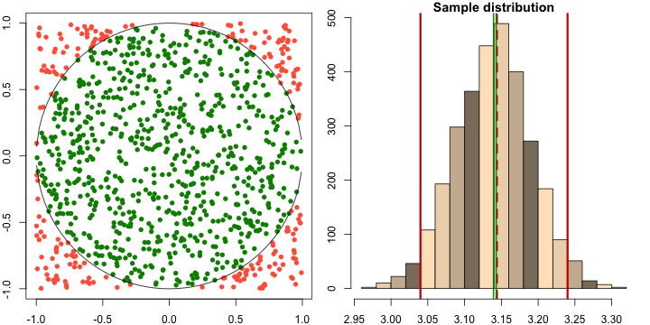

## Introduction

</br>
<p>Bootstrap is an statistical technique used to estimate parameters under a minimum of asumptions.</p>

<p>Bootstrap works resamplig $m$ times a fixed sample of size $n$ with replace and estimating the parameter of interest each time.</p>

<p>From $m$ estimates of soma parameter the empiricaldistribution of the parameters is built, which can be used to construct confidence intervals or testing statistical hypothesis.</p>


<p>From ageometric approach, $\pi$ is defined as the ratio between a circumference an it perimeter.</p>


<p>As it is well known, $\pi$ is an irational number that can be calculated with defined presicion using numeric sequences.</p>


<p>An alternative way to define the number $\pi$ is as expectation of random variable estimated through bootstrap techinque.</p>

---

## Methodology

1. In order to build the empirical distribution of random variable with expectation being the irrational number $\pi$, a sample of size 1000 and bootstrap 3000 repetitions are given.

2. Two random samples of size 1000 are taken from uniform distribution in $(-1, 1)$.

3. If squared sum of each pair of samples is less than one, number one is assigned, otherwise a 0 is assigned. Then proportion is calculated.

4. Every point selected belongs to a square with area equals 4, then 4 times proportion is an estimation of $\pi$.

5. This procedure is repeated 3000 times to find the empirical distribution, summary, expectation and confidence interval are calculated.

6. Two plots are build: scatterplot of las uniform variables selected and histogram of empirical distribution of pi with mean an confidence interval of 95% drawn in vertical red lines and mean confidence through t.test function in green lines.


---

## Notation and algorithm

</br>
</br>
Mathematically the algoritm is as follows:

1. Define an empty numerical vector $v$ of dimension $m$;
3. generate sampes of size $n$ from $x_1\sim\mathcal{U}(-1,1)$ and $x_2\sim\mathcal{U}(-1,1)$, where $\mathcal{U}(a,b)$ is a uniform distribution in the interval $(a,b)$;
3. generate a vector $w$ of 1's an 0's where $w_i = 1$ if $x_{1}^{2} + x_{1}^{2} < 1$, otherwise $w_i = 0$;
4. Proportion of 1's multiplied by 4 in vector $w$ estimates $\pi$;
5. repeat the process $m$ times populating $v$ with estimates in each iteration;
6. vector $v$ is a sample of a random variable with expectation $\pi$. 

---

## Bootstrap

Red lines in histogram are the bounds of confidence interval for a vector $v$, and green dotted lines corresponde to the confidence interval of mean of samples in vector $v$.




---

## Estimation and confidence intervals

**Estimated mean of vector of $\pi$'s**

```
## [1] 3.141163
```

**Summary for $\pi$ empirical distribution**

```
##    Min. 1st Qu.  Median    Mean 3rd Qu.    Max. 
##   2.956   3.104   3.144   3.141   3.176   3.304
```

**Confidence intervel through t.test function for $\mu$ of vector of $\pi$'s**

```
## [1] 3.139329 3.142996
## attr(,"conf.level")
## [1] 0.95
```


